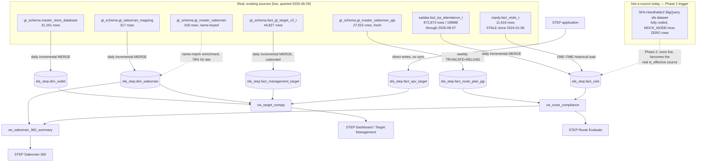
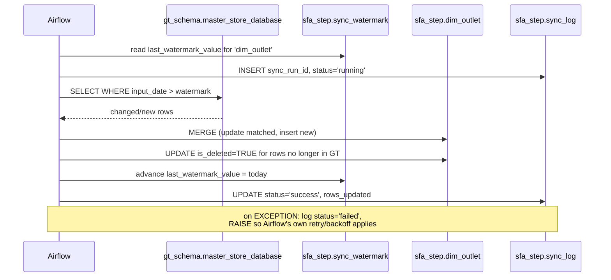

# sfa_step Architecture

**Project:** `skintific-data-warehouse` · **Schema:** `sfa_step` · **Engine:** BigQuery only (decision below)
**Status:** Core slice (Phase 1) — design + scripts only. Nothing in this slice has been created in BigQuery; the service account used for all investigation in this document is read-only (`BigQuery Data Viewer` + `BigQuery Job User`) and cannot create datasets/tables even if instructed to.

---

## 1. Decisions Made (and why)

| Decision | Choice | Rationale |
|---|---|---|
| **Engine** | BigQuery only, single `sfa_step` dataset | Sits alongside every other real "ecosystem" dataset found (`gt_schema`, `repsly`, `sadata`, `rsa`, `mt_schema`) — same project, same tooling, same Airflow-orchestration pattern already proven in this codebase. Trade-off accepted: no true row-level locking / multi-statement ACID transaction for the approval workflow (`fact_spv_target.approval_status`) — BigQuery's MERGE is per-statement atomic but not a multi-table transaction. Mitigation in §5. |
| **Reuse source** | The real, already-live tables (`gt_schema`, `repsly`, `sadata`) | Confirmed: SFA-Handheldv2's own intended schema (BigQuery `sfa` dataset) has **never been created** — `MOCK_MODE=true` always, zero real rows. Building sync scripts against a system with no data would be sync-ing nothing. The already-live tables have real, measurable volume today. |
| **Scope** | Core slice: Outlet, Salesman, Route Plan, Visit, Management Target, SPV Target | Everything Route Evaluate and Target Management's Comply model need. Approvals, notifications, recommendation engine, brand-group RBAC tables, and full audit logging are Phase 2 (§6) — not because they're unimportant, but because validating the entity-resolution and sync approach on a smaller slice first is cheaper than discovering a wrong assumption after building all of it. |
| **Identity resolution across GT/Repsly/sadata** | None (federated rosters, not a conformed dimension) | Confirmed by direct ID-format sampling that no naive bridge exists (`sadata.store_id` like `"12octgen8"` vs `gt_schema.cust_id` like `"IWJA00173"`). Real entity resolution is an MDM project, not a column mapping — explicitly deferred, with a `master_entity_id` placeholder column so it can land later without a schema migration. |

---

## 2. Architecture Diagram

---

## 3. Data Flow — One Sync Cycle (dim_outlet example)

---

## 4. Synchronization Strategy — Rationale Per Table

| Table | Strategy | Why this and not the alternative |
|---|---|---|
| `dim_outlet` | Incremental MERGE, daily | Source has a real `input_date` watermark column; 31K rows is small enough that full-reload would also be cheap, but incremental avoids re-hashing 31K surrogate keys daily for no reason. |
| `dim_salesman` | Incremental MERGE, daily | Same reasoning; tiny volume (317 rows) makes this the lowest-risk table in the whole slice. |
| `fact_route_plan_pjp` | **Full TRUNCATE+RELOAD**, weekly | The source itself is a periodic batch re-upload (`uploaded_at` is shared across many rows per batch), not row-incrementally maintained — there is no reliable per-row "this changed" signal to MERGE against. Truncate+reload matches the source's own update model instead of forcing an incremental pattern onto a non-incremental source. |
| `fact_visit` (SADATA_BA) | Incremental MERGE, daily | This is the actual volume driver (872K rows, 198MB) — the only table in this slice where incremental vs full genuinely matters for cost/time. Watermark = `date`. |
| `fact_visit` (REPSLY_HISTORICAL) | **One-time full load, never repeated** | Confirmed stale (max date 2024-01-06) — there is nothing new to incrementally pull. Re-running the full load is harmless (idempotent MERGE on a deterministic surrogate key) but pointless; it's listed as a script, not a schedule. |
| `dim_outlet_location` | **Full re-aggregate, daily, immediately after `fact_visit`** | Derived entirely *from* `fact_visit` (median GPS per outlet via `APPROX_QUANTILES` + `ST_DISTANCE`), not from any external table — added because `dim_outlet.latitude/longitude` (sourced from `gt_schema.master_store_database`) is confirmed only 12.3% populated. One row per outlet (not per visit), so a full re-aggregate is cheap; an incremental version would also have to handle "this outlet's median shifted because a new check-in arrived," which is no simpler than just recomputing it. |
| `fact_management_target` | Incremental MERGE, daily | Watermark = `calendar_date`. Filters `customer_id IS NOT NULL` at the source query, not after load — confirmed 29% of source rows fail this filter, so filtering early avoids wasted MERGE comparison work. |
| `fact_spv_target` | **Not synced** | STEP-native; the app writes it directly. Listed so its absence from the Airflow DAG isn't mistaken for a missed table. |

**CDC was considered and rejected for this phase:** none of the source tables expose a CDC stream (no Datastream/Debezium-style change feed configured on any of `gt_schema`/`sadata`/`repsly` as far as this investigation found) — implementing CDC would mean standing up new infrastructure on the SOURCE side, which is out of scope for an STEP-side schema design. Watermark-based incremental MERGE achieves the same outcome (no full-table rescans) using only what already exists.

---

## 5. Performance & Storage

**Honest framing: today's real volumes are modest, not "large."** The single biggest table found in this entire investigation is `sadata.fact_ba_attendance_t` at 872,873 rows / 198MB — comfortably small by BigQuery standards. The partitioning/clustering choices below are about **query performance and future-proofing**, not solving an already-massive-data problem that doesn't yet exist in this slice.

| Table | Measured source volume | Partition | Cluster | Estimated sfa_step storage (Year 1) |
|---|---|---|---|---|
| `dim_outlet` | 31,261 rows / 14.3MB | none (dimension, not partitioned) | `source_system, region, brand` | < 20MB |
| `dim_salesman` | 317 rows / 0.1MB | none | `source_system, region, distributor_code` | < 1MB |
| `fact_route_plan_pjp` | 27,915 rows / 4.6MB per batch | `DATE(batch_uploaded_at)` | `salesman_sk, outlet_sk` | ~50-250MB (depends on weekly-reload retention policy — recommend keeping 12 weeks of batches, then archiving older partitions to GCS per §5.2) |
| `fact_visit` | 872,873 + 11,616 rows / ~202MB | `visit_date` | `salesman_sk, outlet_sk` | ~250-400MB (assuming the sadata pipeline resumes/continues at observed rate; flat if it stays paused) |
| `fact_management_target` | 44,827 rows (→ ~134K after brand unpivot) / small | `calendar_date` | `brand, outlet_sk` | < 50MB |

**Total Year-1 estimate: well under 1GB.** This is a rounding error in BigQuery cost terms — on-demand query pricing and storage cost are both negligible at this volume. The clustering/partitioning recommendations exist for **query pruning speed** (e.g. `vw_route_compliance` filtering one ISO week touches one partition, not a full table scan) and to be ready if SFA-Handheldv2 goes live and volume grows 10-100x (§7).

### 5.2 Storage optimization
- **Partitioning:** date-based on every fact table (above) — BigQuery partition pruning means a query for "this week's Route Compliance" only scans that week's partition, not the full history.
- **Clustering:** `salesman_sk`/`outlet_sk` on every fact — these are the columns every STEP page (Dashboard, Route Evaluate, Salesman 360) filters or joins on.
- **Compression:** automatic in BigQuery (columnar storage) — no action needed.
- **Archiving:** `fact_route_plan_pjp`'s partition-by-batch-date makes it trivial to export partitions older than ~12 weeks to GCS (matching the existing `gt_in_transit_after_eom`-style "after EOM" archive pattern already used elsewhere in `dms` dataset) and drop them from the hot table.

### 5.3 Query optimization
- **Materialized views:** none recommended yet (§3 in the data dictionary explains why — recompute cost is negligible at current volume). Revisit `vw_route_compliance` and `vw_salesman_360_summary` specifically if Dashboard load times become noticeable once volume grows.
- **Denormalization:** `fact_visit`'s delete-handling script (sync.sql §4c) re-derives the natural key via two FK subqueries instead of storing it denormalized — flagged in the sync script itself as "correct but not optimal." If `fact_visit` ever needs sub-second delete-detection at scale, add a denormalized `source_natural_key` column.
- **Caching:** BigQuery's own query-result cache covers the read-heavy dashboard views automatically; no apppairlication-level cache layer needed at this volume.

### 5.4 Synchronization optimization
- **Batch size:** none of these loads need chunking at current volume — even the 872K-row `fact_visit` full load is a single BigQuery job, well within normal job limits.
- **Parallelism:** the 5 synced tables have no cross-dependencies except FK resolution (route_plan_pjp and fact_visit both look up `dim_outlet`/`dim_salesman`), so `dim_outlet` and `dim_salesman` syncs should run first and complete before the two FK-dependent fact loads — everything else can run in parallel.
- **Retry/recovery:** `sync_log` + the `BEGIN...EXCEPTION WHEN ERROR...RAISE` pattern in `sfa_step_sync.sql` §5 surfaces failures to the orchestrator; actual retry/backoff is an Airflow-level concern (recommend mirroring the existing SFA Integration Monitor's documented pattern: auto-retry with exponential backoff, max 5 attempts, escalate on exhaustion — this codebase already has that exact design documented in `docs/09-sfa-integration-architecture.md` for a different data flow, reuse it rather than inventing a second retry policy).

---

## 6. Phase 2 (deferred, not designed in this pass)

- **Approvals, notifications, recommendation engine, audit log, brand-group RBAC tables** — these are STEP-native (no external source), same category as `fact_spv_target`. Lower risk to design once the core slice's sync pattern is validated in practice.
- **SFA-Handheldv2 cutover:** once `MOCK_MODE=false` goes live and the `sfa` dataset starts accumulating real rows, `fact_visit.is_effective` should be re-pointed at `sfa.visit_items.effective_call` (purpose-built for exactly this) instead of staying NULL. This is a column-population change, not a schema change — `effective_source` already exists to record the lineage switch.
- **GT-channel real-time visit data gap:** confirmed in this investigation that GT field salesmen have **no** visit-execution data source today comparable to `sadata.fact_ba_attendance_t` — `gt_salesman_time_motion` exists but at only 1,648 rows (a pilot, not full rollout). Route Evaluate's Call/Effective Call concept can only be populated for real, today, for the BA/sadata-tracked channel — not GT salesmen. This should be flagged to stakeholders explicitly, not discovered later.
- **MDM / entity resolution** across GT/Repsly/sadata identities (§4 in the data dictionary) — a real project, deliberately not attempted here.

---

## 7. Risks & Mitigations

| Risk | Evidence | Mitigation |
|---|---|---|
| `repsly.fact_visits_t` is dead | Confirmed max date 2024-01-06 by direct query | Modeled as one-time historical load only, never scheduled incrementally — already reflected in the sync script, not a future fix needed |
| `sadata.fact_ba_attendance_t` pipeline may have also paused | Max date confirmed 2025-08-07 at design time — re-check freshness before assuming "daily" sync is meaningful | Before activating the daily schedule, run `SELECT MAX(date) FROM sadata.fact_ba_attendance_t` again; if it hasn't advanced, escalate to the sadata app owner before building anything that assumes fresh data |
| `gt_master_salesman` name-join enrichment is only 78% reliable | Measured: 247/317 exact matches | `dim_salesman` leaves `spv_name`/`asm_name`/`region` NULL rather than guessing on a fuzzy match — downstream views must handle NULL, not assume populated |
| `kode_toko`↔`cust_id` join for `fact_route_plan_pjp` is assumed, not confirmed | Visual format similarity only, no full join executed | Validation query included inline in `sfa_step_sync.sql` §1c — run it before trusting this table's FK fill rate |
| `gt_schema.fact_gt_target_v2_t` has real data-quality nulls | Confirmed 29% of rows have no `customer_id` | Filtered at source-query time in every sync script, not silently dropped after the fact |
| BigQuery has no multi-statement ACID transaction for the approval workflow | Architectural limitation of the chosen engine (§1) | `fact_spv_target.approval_status` changes happen as single-row UPDATEs (BigQuery guarantees per-statement atomicity) rather than a multi-table transaction; if STEP's approval workflow later needs true cross-table atomicity (e.g. "approve target AND write audit log AND notify, all-or-nothing"), revisit the polyglot Postgres-OLTP option from the original `docs/04-database-erd.md` recommendation for that specific workflow only, not the whole schema |
| No cross-system entity resolution | Confirmed incompatible ID formats by direct sampling | Explicitly deferred (§6), `master_entity_id` reserved so it can land without a migration |

---

## 8. Related Documents

[`sfa_step_ddl.sql`](sfa_step_ddl.sql) · [`sfa_step_sync.sql`](sfa_step_sync.sql) · [`sfa_step_data_dictionary.md`](sfa_step_data_dictionary.md) · prior STEP architecture: [`../../docs/04-database-erd.md`](../../docs/04-database-erd.md), [`../../docs/09-sfa-integration-architecture.md`](../../docs/09-sfa-integration-architecture.md)
