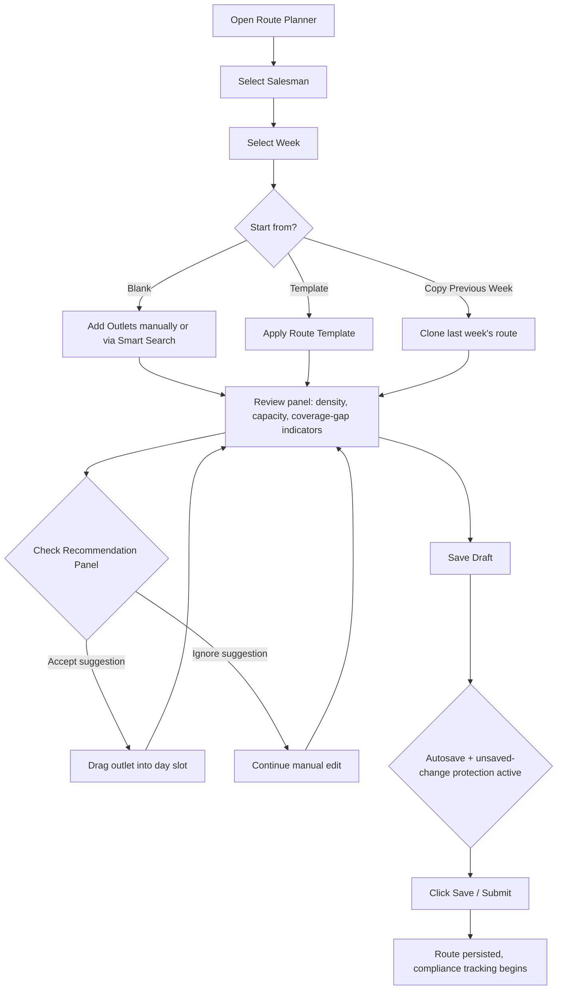
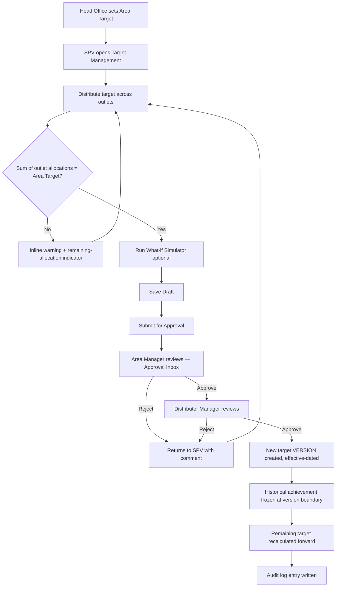
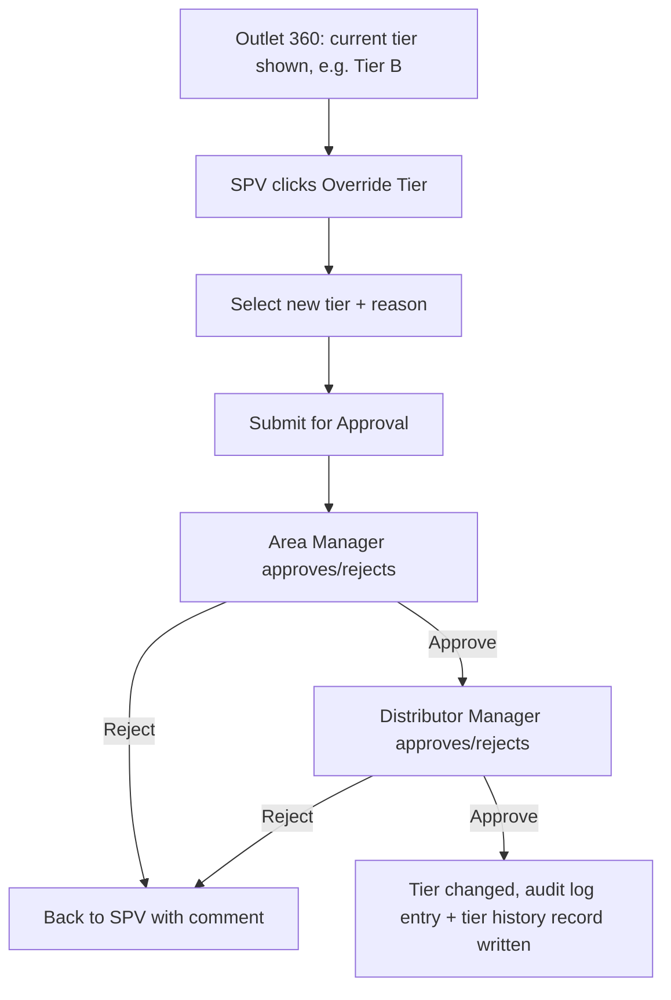
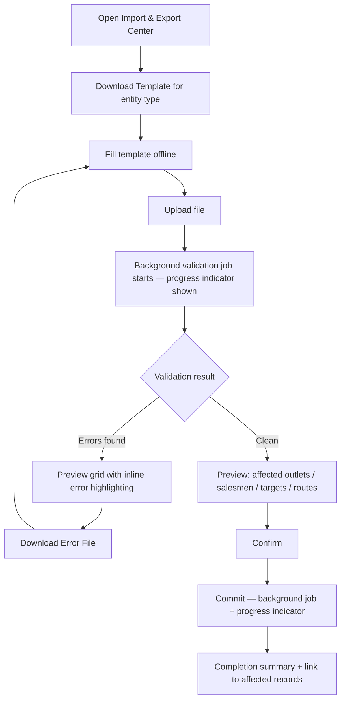
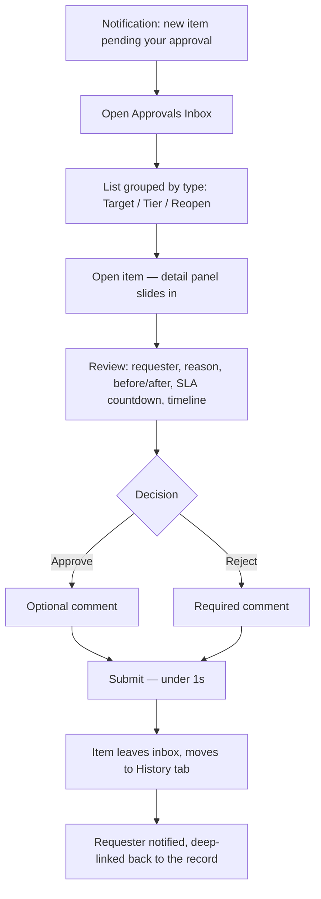
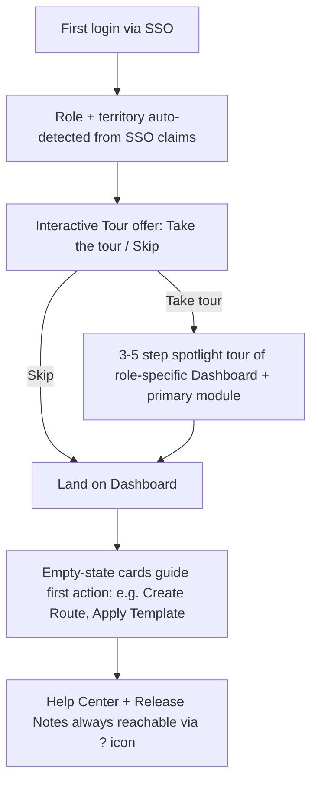

# UX Flow Diagrams
## Skintific Territory & Execution Platform (STEP)

All diagrams are [Mermaid](https://mermaid.js.org/) — render directly in GitHub/most markdown viewers, or paste into the Mermaid Live Editor.

## 1. Route Planning Flow (SPV)

**Key UX rules:**
- Every step before "Save" is recoverable — autosave to local draft persistence (survives tab close / offline) per PRD §7.2.
- The Recommendation Panel is always visible alongside the planner, never a blocking modal — assignment stays manual (PRD §9 FR-6).
- Leaving the planner with unsaved changes triggers a confirmation dialog (Unsaved Change Protection).

## 2. Target Allocation + Approval Flow (SPV → AM → DM)

**Key UX rules:**
- The submit button is disabled (not hidden) while D is unsatisfied — show the exact remaining/over amount, never just "invalid."
- Rejection always bounces to the original submitter (SPV) with the rejecting role's comment attached — never a dead end. This mirrors the validated PO Portal bounce-back pattern (Finance/Logistics rejection → returns to SA, not lost).
- Step L never overwrites; see [04-database-erd.md](04-database-erd.md#target-versioning) for the versioning model.

## 3. Tier Override Flow (SPV → AM → DM)

Same 3-step chain and bounce-back rule as Target Adjustment — see [08-approval-workflow.md](08-approval-workflow.md) for the formal state machine shared by all three approval types (Target Adjustment, Tier Override, Request Reopen).

## 4. Import / Export (Bulk Upload) Flow

**Key UX rule:** nothing commits without the explicit Preview → Confirm step (FR-4). Large files never block the UI — upload and validation both run as background jobs with a visible progress indicator, consistent with the platform's 2s/3s interactive budgets (heavy work is explicitly exempted into the background, not into a frozen spinner).

## 5. Approval Inbox — Reviewer Flow (AM / DM)

**Key UX rule:** rejection requires a comment (so the bounce-back in Flow 2/3 always carries actionable feedback); approval comment is optional. SLA indicator changes color (on-track → at-risk → breached) rather than just showing a number, so non-tech-savvy reviewers triage at a glance.

## 6. Onboarding Flow (first login, any role)

## 7. Related Documents

[01-PRD.md](01-PRD.md) · [08-approval-workflow.md](08-approval-workflow.md) · [07-screen-specifications.md](07-screen-specifications.md)
