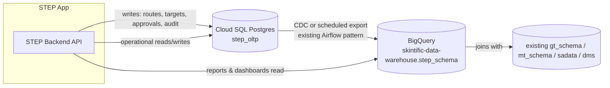
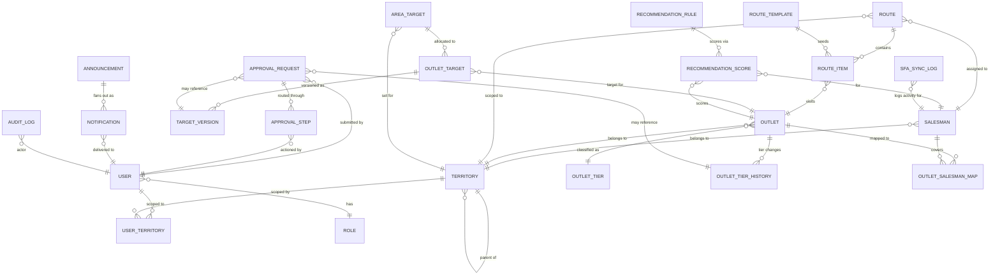

# Database Entity Diagram & Recommendation
## Skintific Territory & Execution Platform (STEP)

## 1. Database Recommendation

STEP has two very different data workloads, and the recommendation is to **not** force both into one engine:

| Workload | Characteristics | Recommended engine |
|---|---|---|
| **Operational / transactional** — route CRUD, approval state machine, target versioning, audit log, notifications | High write concurrency, row-level locking, referential integrity, multi-step transactions (e.g. "commit target version + freeze achievement + write audit log" must be atomic) | **Cloud SQL for PostgreSQL** (or equivalent managed Postgres) |
| **Analytical / reporting** — Sell-In YTD, leaderboards, compliance trend, dashboards | Large scans, aggregations, joins against existing `gt_schema`/`mt_schema`/`sadata`/`dms` BigQuery datasets | **BigQuery** (`skintific-data-warehouse`) — already the company's analytical system of record |

**Why not BigQuery for everything:** BigQuery has no row-level locking, no cheap single-row UPDATE, and no multi-statement ACID transaction model — all of which the approval workflow and target-versioning engine need (FR-2/FR-3 in the PRD require atomic writes with audit trail). Using it as the OLTP store would force application-level workarounds for things Postgres gives for free.

**Why not Postgres for everything:** the company has already invested in BigQuery as the reporting/analytics backbone (existing Airflow DAGs, `gt_schema`/`mt_schema`/`sadata`/`dms`/`rsa` datasets — see project memory on data schemas). STEP's reports module should join against that existing warehouse rather than duplicate years of sell-in history into a new Postgres instance.

**Recommended pattern: operational store + nightly/streaming sync to warehouse**



This mirrors the existing Airflow ETL pattern already proven in this codebase (API/source → staging → MERGE into BigQuery) — STEP would add a `step_schema` dataset and a DAG that syncs Postgres → BigQuery on the same cadence the rest of the warehouse already runs on, rather than introducing a new paradigm.

## 2. Entity Diagram (operational store)



## 3. Core Table Definitions

### Identity & territory

```
USER (id, name, email, sso_subject, role_id, status, created_at)
ROLE (id, code [spv|area_manager|distributor_manager|regional_sales|ho_admin], name)
TERRITORY (id, parent_id, level [national|region|area|distributor|route], name, code)
USER_TERRITORY (user_id, territory_id)   -- many-to-many: a user can be scoped to >1 node
```

### Outlet & Salesman

```
OUTLET (id, code, name, territory_id, tier_id, address, lat, lng, status, created_at, updated_at)
OUTLET_TIER (id, code [S|A|B|C|D], name, rule_definition_json)
OUTLET_TIER_HISTORY (id, outlet_id, old_tier_id, new_tier_id, reason, source [auto|manual_override],
                      approval_request_id, changed_by, changed_at)
SALESMAN (id, code, name, territory_id, status, created_at)
OUTLET_SALESMAN_MAP (id, outlet_id, salesman_id, effective_from, effective_to)
```

### Route Planning

```
ROUTE (id, salesman_id, territory_id, week_start_date, status [draft|saved|locked], created_by, updated_at)
ROUTE_ITEM (id, route_id, outlet_id, planned_date, sequence_no, status [planned|visited|missed])
ROUTE_TEMPLATE (id, territory_id, name, definition_json, created_by)
```

### Target Management (versioned — see §4 below)

```
AREA_TARGET (id, territory_id, period [YYYY-MM], amount, set_by, created_at)
OUTLET_TARGET (id, area_target_id, outlet_id)
TARGET_VERSION (id, outlet_target_id, version_no, amount, effective_date,
                approval_status [draft|submitted|approved|rejected|locked],
                approval_request_id, created_by, created_at)
```

### Approval Governance

```
APPROVAL_REQUEST (id, type [target_adjustment|tier_override|reopen_request], entity_ref_id,
                   submitted_by, territory_id, status [submitted|pending_l1|pending_l2|approved|rejected],
                   sla_due_at, created_at)
APPROVAL_STEP (id, approval_request_id, step_no [1|2], approver_role [area_manager|distributor_manager],
               actioned_by, decision [pending|approved|rejected], comment, actioned_at)
```

### Recommendation Engine

```
RECOMMENDATION_RULE (id, factor_code [last_visit_days|sellin_growth|outlet_tier|potential_score|new_outlet|route_proximity],
                      weight, threshold_config_json, updated_by, updated_at)
RECOMMENDATION_SCORE (id, outlet_id, salesman_id, week_start_date, score, category [critical|recommended|optional],
                       reasoning_json, computed_at)
```

### Notification, Announcement, Audit, SFA

```
NOTIFICATION (id, user_id, category [approval|routing|target|system|announcement], title, body,
              deep_link, read_at, created_at)
ANNOUNCEMENT (id, type [campaign|policy|meeting|distributor|training], title, body, audience_territory_id,
              published_by, published_at, expires_at)
AUDIT_LOG (id, actor_id, entity_type, entity_id, action, before_json, after_json, reason, created_at)
SFA_SYNC_LOG (id, salesman_id, sync_batch_id, status [healthy|partial|failed], records_synced,
              records_failed, error_detail, synced_at)
```

## 4. Target Versioning Model (detail)

This is the mechanism behind PRD FR-3 ("never overwrite a target"):

- Each `OUTLET_TARGET` has many `TARGET_VERSION` rows, never a mutable `amount` column on the parent.
- A new version is only created through an **approved** `APPROVAL_REQUEST` (type = `target_adjustment`) — there is no direct-write path, including from Admin tooling, per PRD FR-3.
- `effective_date` determines which version is "current" for achievement calculation as of any given date — achievement already booked before a version's `effective_date` stays attributed to the prior version (the freeze described in UX Flow 2).
- Querying "what was outlet X's target on date Y" is always `SELECT ... WHERE effective_date <= Y ORDER BY effective_date DESC LIMIT 1` — fully reconstructable, fully auditable.

## 5. Reporting Layer (BigQuery `step_schema`)

Mirrors the operational tables above, denormalized for reporting where it helps (e.g., a flattened `fct_route_compliance` table joining `ROUTE_ITEM` × actual SFA visit data, refreshed daily by the same Airflow pattern used elsewhere in this codebase). Reports module (PRD §7.7) queries this dataset, never the live OLTP store directly, so heavy analytical queries never compete with operational write traffic.

## 6. Related Documents

[01-PRD.md](01-PRD.md) · [05-api-recommendation.md](05-api-recommendation.md) · [09-sfa-integration-architecture.md](09-sfa-integration-architecture.md)
