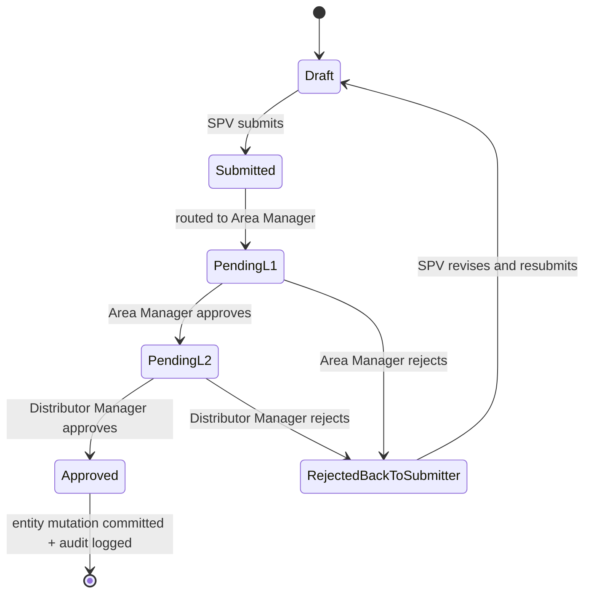

# Approval Workflow Diagrams
## Skintific Territory & Execution Platform (STEP)

All three approval types — **Target Adjustment**, **Tier Override**, **Request Reopen** — share one state machine. They differ only in what `entity_ref` they point to (a `TARGET_VERSION`, an `OUTLET_TIER_HISTORY` row, or a locked record being reopened) and what fields appear in the detail panel.

## 1. Shared State Machine



**Bounce-back rule:** a rejection at *either* L1 or L2 returns to the original submitter (SPV) with the rejecting role's comment attached — never to a dead end and never silently dropped. This is the same principle validated in the PO Portal mockup's approval chain (Finance/Logistics rejection returns to SA, not lost) — reused here because it tested well with non-tech-savvy users who need an obvious "what do I do next" path.

## 2. Configurable Approval Matrix

The 2-step chain (Area Manager → Distributor Manager) is the default. Distributor Manager is a **Head Office role with national scope**, so it always exists — the realistic exception is the opposite of what an earlier draft of this doc assumed: some small or flat territories may have no separate **Area Manager**, in which case SPV submissions should route directly to the Head Office Distributor Manager. The Approval Matrix Configuration (Administration module) lets Head Office Admin define, per territory or territory-type:

```mermaid
flowchart LR
    A[Approval Matrix Config] --> B{Territory has its own Area Manager?}
    B -->|Yes| C[2-step: SPV → Area Manager → Distributor Manager (HO)]
    B -->|No| D[1-step: SPV → Distributor Manager (HO) directly]
```

This is configuration data (`APPROVAL_STEP` definitions keyed by territory), not a code branch — adding/removing a step never requires a deployment, consistent with the Recommendation Rules' "no deployment" principle.

## 3. SLA Model

| Stage | Default SLA | Indicator behavior |
|---|---|---|
| Pending L1 (Area Manager) | 24h | Green until 18h elapsed, amber 18–24h, red after 24h (breached, stays in queue, escalation notification fires) |
| Pending L2 (Distributor Manager) | 24h | Same thresholds, clock restarts at L2 entry |

SLA breach does **not** auto-approve or auto-reject — it only escalates visibility (notification to the approver's manager + a red SLA chip in the inbox). Auto-deciding governance actions was explicitly rejected as a design choice: every approval keeps a human decision-maker by design (same "explainable, never automatic" principle as the Recommendation Engine).

## 4. Per-Type Detail Panel Contents

| Type | Detail panel shows |
|---|---|
| **Target Adjustment** | Outlet, current version amount, proposed amount, delta %, reason, impact on area-target sum |
| **Tier Override** | Outlet, current tier, proposed tier, auto-engine tier (for comparison), reason |
| **Request Reopen** | Locked entity reference (e.g. a locked monthly target), reason for reopen request, what would become editable if approved |

All three share: requester, comments thread, SLA countdown, full timeline (submitted → L1 decision → L2 decision).

## 5. Related Documents

[01-PRD.md](01-PRD.md) · [03-ux-flows.md](03-ux-flows.md) · [04-database-erd.md](04-database-erd.md#approval-governance) · [`../prototype/approvals.html`](../prototype/approvals.html)
