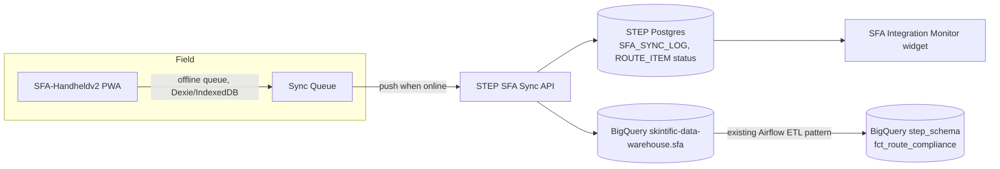
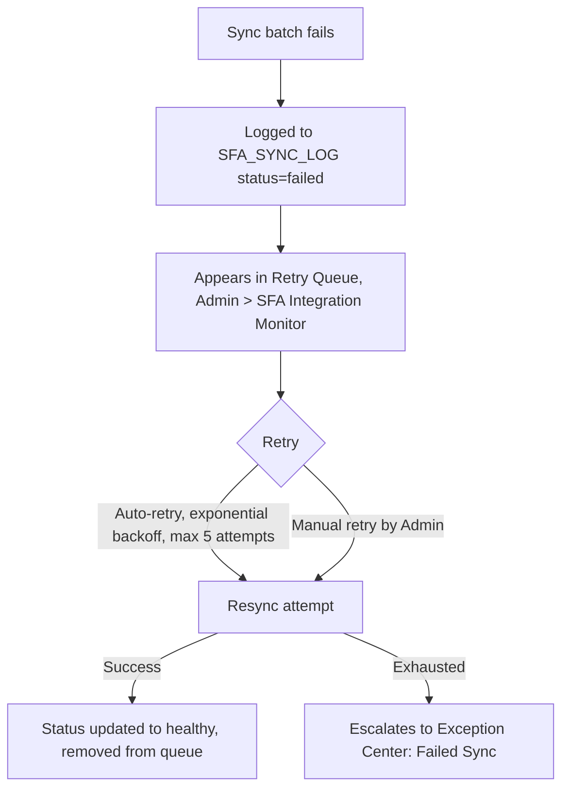

# SFA Integration Architecture
## Skintific Territory & Execution Platform (STEP)

## 1. Context

STEP plans the work; the SFA handheld apps execute it in the field. Per the 2026-06-22 digital architecture audit, the relevant SFA estate is:

- **`SFA-Handheldv2`** — active field-rep PWA (React 19 + Vite + Express, offline-first via Dexie/IndexedDB sync queue), BigQuery `skintific-data-warehouse.sfa` dataset + GCS `sfa-portal-photos`.
- **`SFA-Portal`** — supervisor/admin approval layer for field visits (SPV → ASM → DDM chain), but its actual system-of-record today is a Google Apps Script Web App writing to Google Sheets, not BigQuery (BigQuery is wired but unused while `MOCK_MODE` logic dominates).
- **`sfa-handheld`** — legacy, deprecated.

**This is a real open dependency, not a detail to gloss over:** STEP's integration design below assumes a stable contract with `SFA-Handheldv2`'s BigQuery `sfa` dataset. If `SFA-Portal`'s Apps Script/Sheets backend is still the operative system-of-record for visit approvals by the time STEP integrates, STEP needs either (a) a second, interim sync path against that Sheets backend, or (b) the Sheets backend to be retired first. **Resolve this before SFA Integration Monitor implementation begins** (carried as PRD open question #3).

## 2. Sync Architecture

- The handheld pushes **visit checkpoints** (outlet arrival/departure, photo proof) and **order/sell-in events** through its existing offline-first sync queue — STEP does not change how the handheld works, it only adds a consuming endpoint (`POST /api/v1/sfa/sync/visits`, `POST /api/v1/sfa/sync/orders` — see [05-api-recommendation.md](05-api-recommendation.md#4-sfa-integration-endpoints-consumed-by-sfa-handheldv2--produced-for-step)).
- Each sync batch writes an `SFA_SYNC_LOG` row (status, records synced/failed) — this is what powers the Integration Monitor, not a live probe of the handheld.
- A `ROUTE_ITEM.status` (`planned → visited/missed`) updates from the matching visit checkpoint, which is what makes Route Compliance % computable.

## 3. Status Taxonomy

| Status | Meaning | UI treatment |
|---|---|---|
| **Healthy** | ≥ 98% of batches synced successfully in the trailing 24h | Green pill |
| **Partial Sync** | 80–98% success, or a salesman has a stale queue (>4h unsynced while device shows online) | Amber pill, lists affected salesmen |
| **Failed** | < 80% success, or sustained sync failure > 24h for any salesman | Red pill, surfaces in Exception Center automatically |

## 4. Retry Queue

## 5. Data Contract Boundary

- STEP **never writes** into the handheld's local Dexie/IndexedDB store — sync direction for visit/order data is handheld → STEP only.
- STEP **does write** plan data the handheld consumes read-only: `ROUTE`/`ROUTE_ITEM` (the planned visit schedule) and `OUTLET_TARGET`/current `TARGET_VERSION` (so the rep's app can show "today's target" without re-deriving it). This direction is plan → execution, matching the PRD's framing of STEP as upstream of the handheld.
- Any schema change on either side goes through the same `/api/v1` versioning discipline as the rest of STEP's API (see [05-api-recommendation.md](05-api-recommendation.md#1-style--conventions)) — `SFA-Handheldv2` is an external consumer like any other client, not a special case.

## 6. Related Documents

[01-PRD.md](01-PRD.md) · [05-api-recommendation.md](05-api-recommendation.md) · [`../prototype/administration.html`](../prototype/administration.html) (SFA Integration Monitor tab)
