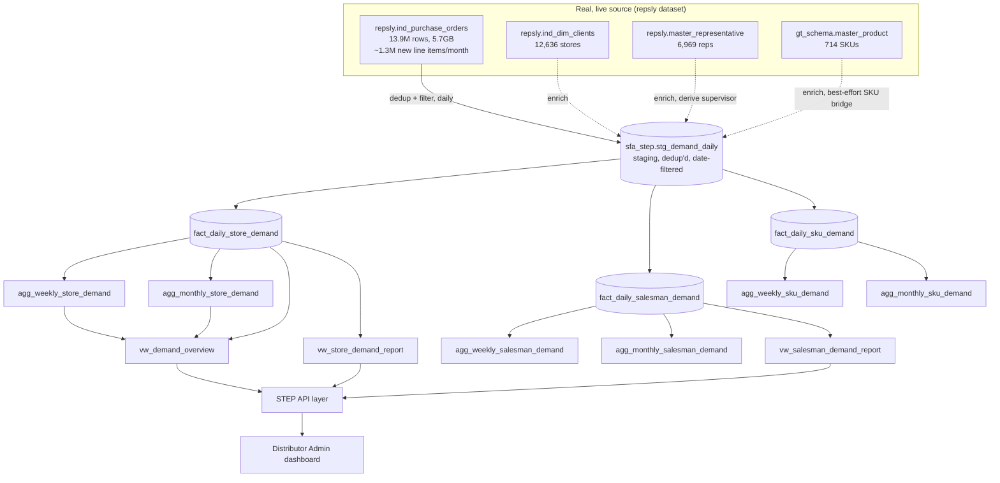
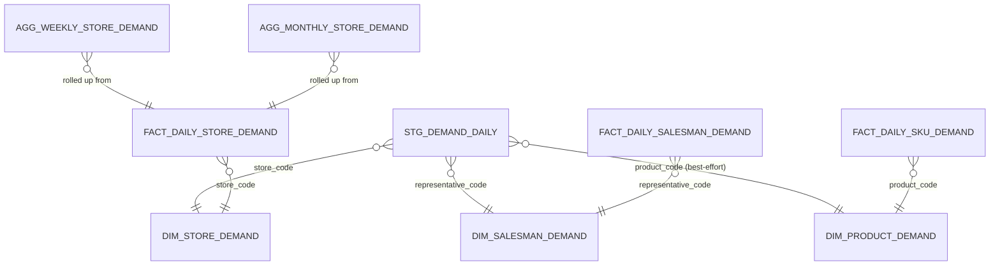

# STEP — Demand Monitoring Report Architecture

**Project:** `skintific-data-warehouse` · **Schema:** `sfa_step` · **Engine:** BigQuery (same as the rest of `sfa_step`)

---

## 1. Source-to-Report Data Flow

**Why a staging table, not raw-to-fact directly:** the dedup/filter logic in functional spec §3.3 (exclude `line_no` as a key, drop exact re-sync duplicates, guard against typo'd future dates) is non-trivial enough that doing it once into a staging table — then building three fact tables from the *same* clean staging data — is cheaper and less error-prone than repeating the same `QUALIFY ROW_NUMBER()` logic three times against the 13.9M-row raw table.

---

## 2. Entity Relationships

`DIM_STORE_DEMAND`/`DIM_SALESMAN_DEMAND`/`DIM_PRODUCT_DEMAND` are **thin reporting-specific views** over the existing `repsly.ind_dim_clients`/`master_representative`/`gt_schema.master_product` — not new physical dimension tables. This deliberately does **not** reuse `sfa_step.dim_outlet`/`dim_salesman` from the core slice: those are federated rosters keyed by `(source_system, natural_key)` built for GT/SADATA/REPSLY-historical data, and adding a fourth `ind_dim_clients`/`master_representative` source-system row there would need the same unconfirmed-bridge caveats as everywhere else in this project — for a reporting-only feature with its own clear source, a focused thin view is simpler and avoids coupling this module's correctness to changes in the unrelated core-slice dimensions.

---

## 3. Synchronization Architecture — Strategy Comparison

| Approach | Advantages | Disadvantages | Est. cost | Est. performance | Scalability |
|---|---|---|---|---|---|
| **Real-time view** (query `ind_purchase_orders` live on every dashboard load) | Zero staleness, zero pipeline to maintain | Every dashboard load rescans up to 13.9M rows for *any* aggregation; dedup logic (functional spec §3.3) must run on every query, not once; comparative DoD/WoW/MoM needs self-joins over the full table — no realistic way to hit the <3s target as volume grows | Low to build, **high recurring** (full-table scan cost on every page view) | Fails the <3s/<2s targets once a few users hit it concurrently | Gets worse linearly with raw row count — the wrong direction |
| **Scheduled ETL → daily fact tables** (recommended) | Dedup/filter logic runs once per day, not once per query; daily fact tables are 1-2 orders of magnitude smaller than raw (tens of thousands of rows/day vs 13.9M total); weekly/monthly/rolling build from the *small* daily fact, not raw data | Daily, not real-time — demand from 5 minutes ago won't show until the next scheduled run | Low recurring (one batch job/day over the full raw table, or incremental — see below) | Dashboard queries hit a table sized for the question being asked, not the whole history | Scales with *daily* volume, not cumulative volume — flat going forward |
| **Incremental sync** (only reprocess `document_date`s with new rows since last run) | Much cheaper than reprocessing all history daily | The dedup logic in §3.3 needs to consider rows that *change* after the fact (e.g. a return posted against an order from 3 days ago) — incremental-only risks missing late corrections to already-processed days | Lowest recurring cost | Same as scheduled ETL once the fact tables exist | Best long-term — combine with a periodic full-history reconciliation (see sync script §3) |
| **CDC** | Lowest latency of any option | No CDC capability exists on the `repsly` dataset side (it's itself a downstream ETL output, not a live OLTP source) — would require building CDC infrastructure on a system this project doesn't own | High (new infra) | N/A | N/A — not feasible without a source-side change outside this project's control |
| **Materialized view refresh** (BigQuery native) | No custom pipeline code for the refresh itself | BigQuery materialized views require the base query to be free of non-deterministic functions and have real limits on supported aggregation patterns (window functions like the DoD/WoW/MoM `LAG()` comparisons aren't supported in a materialized view definition) | Low to build | Good for the *simple* aggregates it can express | Limited to the cases its SQL-subset restrictions allow — not viable for the comparative-analytics layer |

**Recommendation: Scheduled ETL building daily fact tables, with an incremental window plus a periodic full reconciliation pass (detailed in the sync script).** This is the only option of the five that can plausibly hit every stated performance target (§4) while handling the real, confirmed data-quality issues in functional spec §3.3 correctly. Materialized views are still used, but *layered on top of* the daily fact tables (for the weekly/monthly aggregates that don't need window functions), not as the primary sync mechanism against raw data.

---

## 4. Performance Considerations

| Target | How this design hits it |
|---|---|
| Dashboard load < 3s | Dashboard queries hit `agg_weekly_*`/`agg_monthly_*` (pre-aggregated, partition-pruned) or `fact_daily_*` filtered to a narrow date range — never the 13.9M-row raw table |
| Filter response < 2s | Fact/agg tables are clustered on the exact columns the brief's filters target (`store_code`, `representative_code`, `product_code`, `region`) |
| Export < 10s | Exports read from the same fact/agg tables, not raw data — even a full-history CSV export of a daily fact table is a small fraction of the raw row count |
| Large dataset support | Partitioning by date on every fact/agg table means a query for "this month" only ever touches that month's partitions, regardless of how many years of history accumulate |
| Future growth | Daily fact tables grow with *daily* transaction volume, which is roughly flat even as historical retention grows — query cost doesn't increase for "give me last 30 days" no matter how many years of history exist behind it |

---

## 5. Scalability Recommendations

- **Partitioning**: every fact/agg table partitioned by its date column (`demand_date`, `week_start_date`, `month_start_date`).
- **Clustering**: `store_code`/`representative_code`/`product_code`/`region` depending on the table — matches the brief's own filter/sort/ranking requirements directly.
- **Retention**: raw `repsly.ind_purchase_orders` is not owned by this project (no retention action taken there). `stg_demand_daily` (the deduplicated staging layer) only needs to retain a rolling window (e.g. 400 days) since the fact tables are the durable record once built — same retention pattern as `fact_visit` in the core slice.
- **Caching**: BigQuery's automatic query-result cache covers the read-heavy dashboard views without any application-level cache layer needed at current volume.

---

## 6. Risks

| Risk | Mitigation |
|---|---|
| Source duplicate/data-quality issues (functional spec §3.3) recur or worsen | Reconciliation query (sync script §5) compares raw-vs-staged row/amount totals on every run and alerts if the gap exceeds an expected dedup ratio |
| `product_code` ↔ `master_product.sku` bridge degrades further (already unconfirmed) | Reconciliation query reports the match rate every run — a dropping match rate is visible immediately, not discovered months later |
| `distributor_code` remains unavailable on the store dimension | Documented as a known, current gap (functional spec §3.2/4.5) rather than worked around with an invented field — Distributor Admin row-level security currently operates at the Region level in practice until this is resolved |
| Daily ETL failure delays freshness | Same retry/alerting pattern already established for the core `sfa_step` slice (Airflow `BigQueryInsertJobOperator`, `email_on_failure`) — no new pattern invented |

---

## 7. Related Documents

[`step_demand_report_functional_spec.md`](step_demand_report_functional_spec.md) · [`../database/schema/sfa_step_demand_report.sql`](../database/schema/sfa_step_demand_report.sql) · [`../database/schema/sfa_step_demand_sync.sql`](../database/schema/sfa_step_demand_sync.sql) · [`step_demand_report_api.md`](step_demand_report_api.md)
