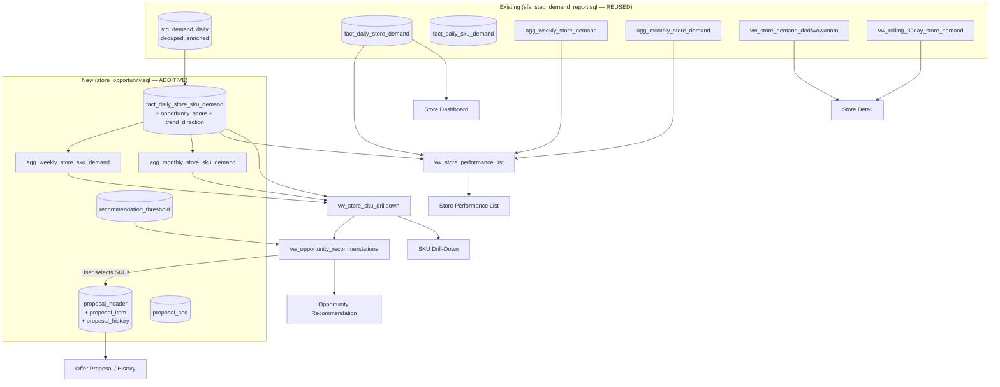

# STEP — Store Opportunity Module Architecture

---

## 1. Navigation Impact Assessment

**Change summary:** `store-opportunity` added as a new NAV entry in `step.js` between `dashboard` and `route-evaluation`. The `store-opportunity.html` prototype page is the expected counterpart (to be built — the functional spec defines its 6-page structure). No existing page is removed, modified, or broken by this NAV change.

**Ripple:** Every existing page already using `STEP.renderShell(activeId)` will show the new "Store Opportunity" item in their sidebar automatically — this is the established shell mechanism, working correctly by design. No per-page changes needed.

---

## 2. Data Architecture — Source to Report



**Reuse ratio:** 7 of the 12 objects needed for Store Opportunity already exist in `sfa_step_demand_report.sql` (stg_demand_daily, fact_daily_store_demand, agg_weekly/monthly_store_demand, vw_store_demand_dod/wow/mom, vw_rolling_30day_store_demand). Only 5 new physical tables + 4 new views are added.

---

## 3. New Object Summary

| Object | Type | Purpose |
|---|---|---|
| `fact_daily_store_sku_demand` | Physical table | Combined store×SKU daily grain — foundation of Pages 4/5; also carries pre-computed `opportunity_score` and `trend_direction` |
| `agg_weekly_store_sku_demand` | Materialized view | Weekly rollup at store×SKU grain (BigQuery-native auto-refresh) |
| `agg_monthly_store_sku_demand` | Materialized view | Monthly rollup at store×SKU grain |
| `proposal_seq` | Physical table | Running-number tracker per distributor×month |
| `recommendation_threshold` | Physical table | Configurable opportunity-scoring rules (weights, thresholds, uplift) |
| `proposal_header` | Physical table | One row per offer proposal — the only real WRITE target |
| `proposal_item` | Physical table | SKUs included in a proposal |
| `proposal_history` | Physical table | Audit trail of all actions on each proposal |
| `vw_store_performance_list` | View | Page 2 display — joined, ranked store list |
| `vw_store_sku_drilldown` | View | Page 4 — per-store SKU breakdown |
| `vw_opportunity_recommendations` | View | Page 5 — classified + scored recommendations |
| `vw_proposal_list` | View | Proposal History display |

---

## 4. Opportunity Score ETL

The `opportunity_score` on `fact_daily_store_sku_demand` is computed at ETL time (not on-read) for performance — a live-computation view over millions of `(store, sku, day)` combinations with min-max normalization across a distributor's full portfolio would be too slow for a <2s filter response target.

**Computation steps (in `sp_refresh_fact_daily_store_sku`):**
1. Aggregate `stg_demand_daily` to `(document_date, client_code, product_code)` grain — `SUM(quantity)`, `COUNT(DISTINCT document_date)` (frequency), `brand`, `category`.
2. Compute per-distributor normalization bounds: `MIN`/`MAX` of `demand_quantity`, `demand_frequency_days`, `growth_pct` within the current distributor's store-sku universe.
3. Apply weighted formula (weights from `recommendation_threshold`) per row.
4. Compute `trend_direction` using the same period-over-period logic as `vw_store_demand_mom` (reuced from existing view rather than re-derived).
5. TRUNCATE + re-INSERT into `fact_daily_store_sku_demand`.

Note: the `sp_refresh_fact_daily_store_sku` procedure (not yet in `store_opportunity.sql` — it's the sync-layer companion, which belongs in a new `store_opportunity_sync.sql` file if/when the sync layer is extended for this module, following the same pattern as `sfa_step_demand_sync.sql`). For the deployment guide, this procedure must be added to the Airflow DAG AFTER `sp_refresh_fact_daily_sku_demand` and `sp_refresh_fact_daily_store_demand`.

---

## 5. Proposal Write Flow

Unlike every other part of this schema (which is read-only for analytics), the Offer Proposal generates real writes:

```
STEP App (Distributor Admin)
  → POST /proposals/generate
  → API: reads vw_opportunity_recommendations for selected store
  → API: UPSERTs proposal_seq (to claim a running number)
  → API: INSERTs proposal_header (proposal_id, proposal_number, all fields)
  → API: INSERTs proposal_item (one row per SKU)
  → API: INSERTs proposal_history (action='generated')
  → Response: proposal_id, proposal_number

  → GET /proposals/{id}/pdf
  → API: reads proposal_header + proposal_item + distributor profile
  → renders HTML → Puppeteer/wkhtmltopdf → PDF stream
  → INSERTs proposal_history (action='printed', export_format='pdf')
  → updates proposal_header.print_count++, last_printed_at
```

BigQuery is NOT ideal as a primary OLTP store for these writes (no row-level locks, no cheap single-row UPDATE) — the same limitation acknowledged in the `sfa_step` architecture doc. The mitigations in place for this case:
- Proposal generation rates are LOW (one Distributor Admin, at most a few proposals per session, not high-frequency batch writes) — BigQuery's per-row DML cost at this volume is acceptable.
- `proposal_seq` UPSERT is the only contention-prone write, and a single Distributor Admin session isn't concurrent enough to cause real conflicts.
- If proposal volume grows (e.g. a bulk generation feature is added), revisit whether `proposal_header`/`proposal_item` should move to Postgres (matching the original core-slice docs recommendation) while the analytics read from the same BigQuery tables.

---

## 6. Reports Restructure — Impact Assessment

| Area | Before | After | Change required |
|---|---|---|---|
| `reports.html` prototype page | Generic, mix of reports | Analytical/informational only (Demand Overview, Salesman/Product/Trend/Executive) | Content update — remove any "Store Performance" placeholders, add the new analytical sections. Underlying view data (`vw_demand_overview`, `vw_kpi_demand` etc) already exists, no new schema work. |
| `step.js` NAV | `reports` entry unchanged | `store-opportunity` added above `reports` | Done — `store-opportunity` already added in this session. |
| Prototype pages | No Store Opportunity pages | `store-opportunity.html` needed | Needs to be built (not in scope for this doc pass — UI prototype is a subsequent step). |

---

## 7. Related Documents

[`store_opportunity_functional_spec.md`](store_opportunity_functional_spec.md) · [`store_opportunity_api.md`](store_opportunity_api.md) · [`store_opportunity_proposal_template.md`](store_opportunity_proposal_template.md) · [`../database/schema/store_opportunity.sql`](../database/schema/store_opportunity.sql) · [`step_demand_report_architecture.md`](step_demand_report_architecture.md)
